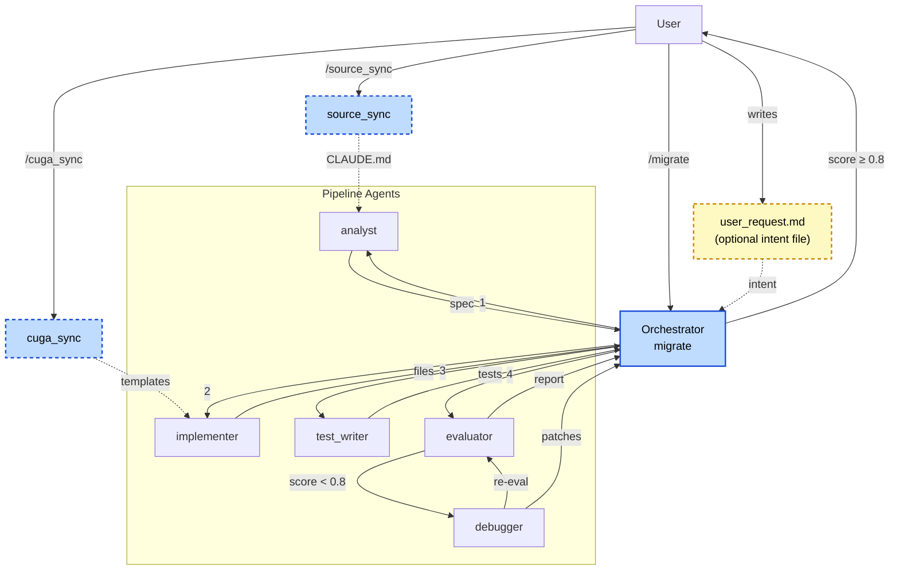
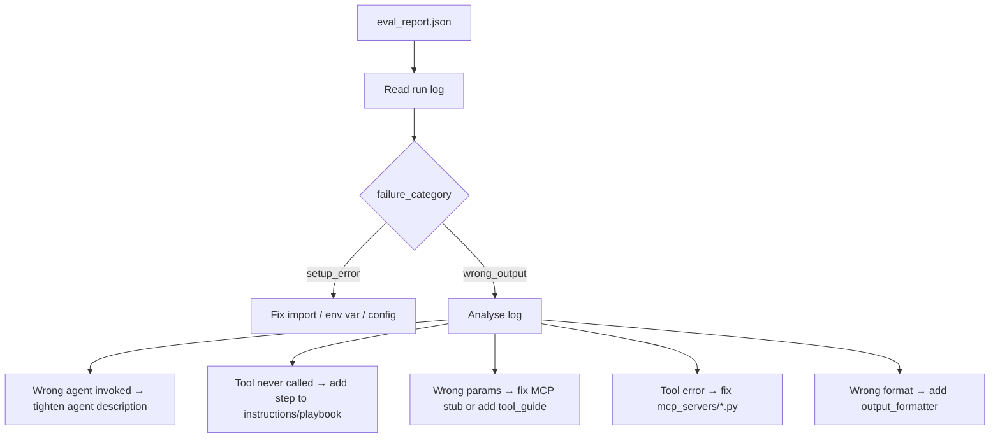
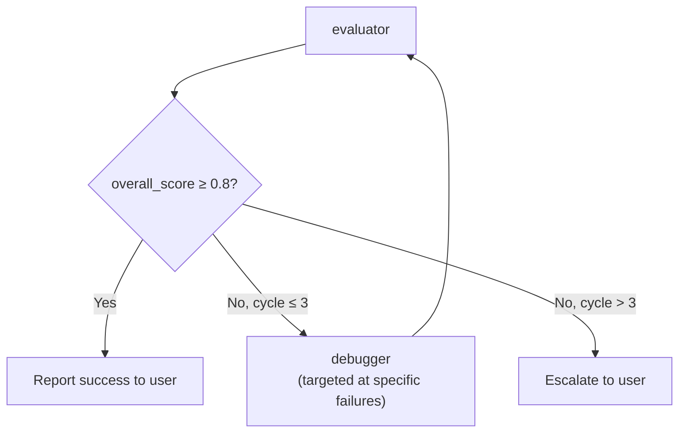
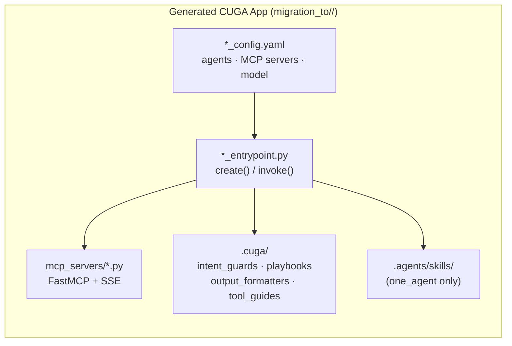

# CUGA Migrator — Design Document

## Overview

The CUGA Migrator is a Claude Code-based pipeline that migrates arbitrary source agent systems into valid [CUGA SDK](migration_to/cuga-agent/) implementations. Everything that drives the pipeline lives under `.claude/`: seven agents (five pipeline agents + two standalone preparation agents), a hook, an MCP tool, and two invocation surfaces — explicit slash commands and natural-language Skills — for the same three entry points.

```
.claude/
├── agents/       # five pipeline agents (analyst, implementer, test_writer, evaluator, debugger)
├── commands/     # migrate (pipeline orchestrator)         — explicit /<name> invocation
│                 # source_sync (standalone preparation agent)
│                 # cuga_sync   (standalone preparation agent)
├── skills/       # cuga-migrator, cuga-source-sync,         — natural-language invocation,
│                 # cuga-template-sync                         auto-matched against a description;
│                 # each just parses the request then follows the matching commands/*.md file
├── hooks/        # PreToolUse logging hook
└── settings.json # permissions and hook wiring
```

---

## Architecture



`source_sync` and `cuga_sync` are invoked independently by the user before the main migration — they are not called by the orchestrator. Their outputs (the source `CLAUDE.md` and updated templates) feed passively into the pipeline via files on disk.

`user_request.md` is an optional file the user writes before running `/migrate`. The orchestrator reads it at startup and surfaces the intent in every sub-agent prompt, shaping decisions (architecture choice, naming, reuse strategy) throughout the entire pipeline.

--- 

## Agent Definitaions(`.claude/agents/`)

Each agent is a markdown file that defines a specialized Claude sub-agent. The orchestrator spawns them via `Agent(agent_name="<name>", prompt="...")`. Every agent fires the `PreToolUse` logging hook on every tool call.

### `analyst.md`

Reads the source repo, CUGA SDK, and templates to produce `migration_spec.md` — the architecture design document for the migration.

**Inputs:** source repo, CUGA SDK, templates, `migration_to/.env`

**Outputs:**
- `migration_to/.cuga-migrator/source_summary.md` — intermediate findings written before loading larger SDK files
- `migration_to/.cuga-migrator/migration_spec.md` — full spec covering agents, MCP servers, policies, and skills

**Key responsibilities:**
- Maps every source agent's workflow step-by-step, then traces each step to an MCP server, a CUGA config field, or a capability gap entry
- Enforces architecture constraints: `CugaSupervisor` itself has no tools, `enable_knowledge: true` replaces custom RAG servers, supervisor has no `special_instructions`
- Chooses among three architectures with written rationale:
  - `supervisor` — CugaSupervisor routing to internal CugaAgents backed by MCP servers
  - `a2a_supervisor_external` — CugaSupervisor routing to existing agents already deployed as A2A services; choose this when the source system has agents that should be reused as-is rather than rewritten
  - `one_agent` — single CugaAgent with all tools loaded directly

---

### `implementer.md`

Reads `migration_spec.md` and writes a complete CUGA SDK implementation into the target directory.

**Inputs:** `migration_spec.md`, copied templates, CUGA SDK, `migration_to/.env`

**Outputs:** all files under `migration_to/<target-name>/`

| Step | File generated |
|------|---------------|
| 1 | `*_config.yaml` — agents, MCP servers, model binding |
| 2 | `*_entrypoint.py` — `create()` / `invoke()` / `stream()` |
| 3 | `mcp_servers/<name>.py` — one FastMCP server per external data source |
| 4 | `.cuga/<type>/<name>.md` — policy files (intent guards, playbooks, output formatters, tool guides) |
| 5 | `.agents/skills/<name>/SKILL.md` — skill files (one_agent only) |
| 6 | `scripts/start.sh` — launches MCP servers and waits for readiness |

---

### `test_writer.md`

Reads ground truth trace files and writes `test_cases.json`.

**Inputs:** `migration_to/data/ground_truth/*.txt` — each file has a `USER INPUT` and `FINAL OUTPUT` section

**Outputs:** `migration_to/<target-name>/test_cases.json`

Each ground truth file becomes one test case (`test_id`, `input`, `expected_output`). No cases are invented; text is never summarised.

---

### `evaluator.md`

Runs the generated agent against every test case, LLM-judges the outputs, and writes `eval_report.json`.

**Inputs:** `test_cases.json`, implementation files, start script

**Outputs:**
- `migration_to/data/prediction/actual_outputs/<test_id>.json`
- `migration_to/data/prediction/logs/<test_id>.log`
- `migration_to/data/prediction/eval_report.json`

**Scoring rubric:**

| Score | Meaning |
|-------|---------|
| 1.0 | Correct — key facts and intent match |
| 0.7 | Partial — right direction, missing detail |
| 0.4 | Weak — intent understood, significant content wrong |
| 0.0 | Failure — wrong, empty, or setup error |

A result passes at `llm_score >= 0.7`. The pipeline advances when `overall_score >= 0.8`.

---

### `debugger.md`

Reads eval failures and run logs, diagnoses root causes, and patches implementation files.

**Inputs:** `eval_report.json`, `logs/<test_id>.log`, implementation files

**Outputs:** patched files + `migration_to/data/debug_log/debug_<n>.md`



---

## Commands (`.claude/commands/`) and Skills (`.claude/skills/`)

Claude Code slash commands are markdown files the user invokes directly with `/<name>`. This project has three commands: one pipeline orchestrator and two standalone preparation agents.

| Command | Role |
|---------|------|
| `/migrate` | Drives the full five-agent migration pipeline |
| `/source_sync` | Scouts the source repo; writes a navigation guide for the analyst |
| `/cuga_sync` | Syncs templates against the current CUGA SDK |

Each command also has a matching **Skill** under `.claude/skills/<name>/SKILL.md` — a natural-language entry point to the same three flows, auto-invoked by Claude Code when a user's request matches the skill's `description` field, without them needing to type the slash command. This mirrors how the [Bob port](../cuga-migrator-bob/) triggers its three skills, since Bob has no slash-command equivalent at all — only description-matched skills. The Claude skill files are intentionally thin: they parse `source_name`/`target_name`/`stages` (or nothing, for `cuga_sync`) out of the free-form request, then say "follow `.claude/commands/<name>.md`" — the command file stays the single source of truth for the actual pipeline logic, so there's nothing to keep in sync by hand beyond the request-parsing preamble.

| Skill | Command it delegates to | Trigger examples |
|---|---|---|
| `cuga-migrator` | `/migrate` | "migrate `<source>` to CUGA", "run the CUGA migration pipeline for `<source>` as `<target>`" |
| `cuga-source-sync` | `/source_sync` | "sync source hints for `<source>`", "scout the source repo" |
| `cuga-template-sync` | `/cuga_sync` | "sync CUGA templates", "check templates against the SDK" |

### `/migrate <source-name> <target-name>`

The main pipeline orchestrator. Drives all five agents in sequence, copies templates before the implementer runs, checks `state.json` to skip already-completed stages on resume, pauses for user review after the spec and after implementation, and runs the eval–debug loop.

**User request:** before starting, the orchestrator reads `migration_to/.cuga-migrator/user_request.md` if it exists. The request is surfaced explicitly in every sub-agent prompt so it shapes architecture choice, naming, and implementation decisions throughout the entire pipeline. Create this file to express high-level intent — e.g. "use A2A to orchestrate existing agents as external services" — before running `/migrate`.

**Eval–debug loop:**



State is written to `migration_to/.cuga-migrator/state.json` after each stage so the pipeline is resumable.

---

### `/source_sync <source-name>`

**Role:** Scout the source repo and write a navigation guide for the analyst.

**When to run:** once per source repo, before `/migrate`.

**What it does:** maps the directory structure, flags large noisy files to skip (test fixtures, lock files, build artifacts), reads the README, and writes `migration_from/<source-name>/CLAUDE.md`. The analyst reads this file first to go straight to relevant entry points without wasting context.

**Output:** `migration_from/<source-name>/CLAUDE.md`

---

### `/cuga_sync`

**Role:** Keep templates in sync with the current CUGA SDK version.

**When to run:** whenever the CUGA SDK (`migration_to/cuga-agent/`) is updated.

**What it does:** reads `sdk.py` and canonical SDK examples, compares every file under `cuga-templates/` against actual SDK behaviour, and fixes stale comments, wrong parameter names, or removed fields. Writes `migration_to/.cuga-migrator/sync_report.md` with a full accounting of every file checked and every change made.

**Output:** updated files under `cuga-templates/`, `migration_to/.cuga-migrator/sync_report.md`

---

## Hooks(`.claude/hooks/`)

### `log_tool_use.sh` — `PreToolUse`

Fires before every tool call across all agents and the orchestrator. Appends a JSON line to `migration_to/.cuga-migrator/logs/tool_log.jsonl`:

```json
{"ts": "2026-06-01T12:00:00Z", "agent": "analyst", "tool": "Read"}
```

Wired in `settings.json` as a global `PreToolUse` hook, and also declared individually in each agent's frontmatter so it fires inside sub-agent sessions too.

---

## MCP in Claude Code

Claude Code supports [Model Context Protocol (MCP)](https://modelcontextprotocol.io) servers as a first-class extension mechanism — MCP servers are registered in `~/.claude.json` and their tools become available to agents alongside built-in tools like `Read`, `Write`, and `Bash`.

This pipeline does **not** ship or depend on any MCP server — every agent uses plain `Read`/`Grep`/`Bash` for both the source repo and the CUGA SDK. An earlier revision used [CodeGraph](https://github.com/colbymchenry/codegraph) (`@colbymchenry/codegraph`) as an optional code-intelligence aid for the analyst/implementer/debugger agents, registered in `.claude/settings.json`'s permissions on the Claude side and `.bob/mcp.json` on the Bob side. It was removed after a Bob run failed outright when the CodeGraph MCP server's connection dropped (`MCP error -32000: Connection closed`) — on Bob, an MCP connection failure appears to abort the whole session rather than just disabling that one server's tools, so an "optional" enhancement was silently capable of taking down an entire migration run. If you want it back, re-add the registration to `.bob/mcp.json` / `.claude/settings.json` and the "prefer codegraph, fall back to Read" guidance to the relevant agent files — but verify it connects reliably in your environment first, since that failure mode is exactly what motivated removing it by default.

---

## Directory Layout

```
cuga-migrator/
├── .claude/
│   ├── agents/
│   │   ├── analyst.md
│   │   ├── implementer.md
│   │   ├── test_writer.md
│   │   ├── evaluator.md
│   │   └── debugger.md
│   ├── commands/
│   │   ├── migrate.md
│   │   ├── source_sync.md
│   │   └── cuga_sync.md
│   ├── hooks/
│   │   └── log_tool_use.sh
│   ├── settings.json
│   └── CLAUDE.md
│
├── cuga-templates/
│   ├── supervisor/             # CugaSupervisor + internal CugaAgents backed by MCP
│   │   ├── supervisor_config.yaml
│   │   ├── supervisor_entrypoint.py
│   │   ├── mcp_servers/mcp_server_template.py
│   │   └── .cuga/
│   ├── a2a_supervisor_external/  # CugaSupervisor + independently deployed agents via A2A
│   │   ├── supervisor_config.yaml
│   │   ├── supervisor_entrypoint.py
│   │   ├── a2a_agents/a2a_agent_template.py
│   │   └── .cuga/
│   └── one_agent/              # single CugaAgent + skills
│       ├── agent_config.yaml
│       ├── agent_entrypoint.py
│       ├── mcp_servers/mcp_server_template.py
│       ├── .cuga/
│       └── .agents/skills/skill_template/SKILL.md
│
├── migration_from/<source-name>/    # source repo (read-only)
└── migration_to/
    ├── cuga-agent/                  # CUGA SDK runtime (read-only)
    ├── <target-name>/               # generated CUGA application
    ├── data/
    │   ├── ground_truth/            # trace .txt files (read-only)
    │   └── prediction/              # eval outputs
    └── .cuga-migrator/              # pipeline state and logs
        ├── user_request.md          # (optional) user's high-level migration intent
        ├── migration_spec.md        # analyst output
        ├── source_summary.md        # analyst intermediate notes
        ├── state.json               # pipeline progress tracker
        └── sync_report.md           # cuga_sync output
```

---

## Generated CUGA Application Structure



**Supervisor** — `CugaSupervisor` routes tasks to N internal `CugaAgent` sub-agents. Each sub-agent owns its MCP servers and policies. The supervisor calls no tools directly.

**A2A Supervisor (external)** — `CugaSupervisor` routes tasks to N independently deployed agents exposed via the A2A protocol. No MCP servers or internal agents — the supervisor sends natural-language task messages to external HTTP endpoints and receives results. Use when existing agents should be reused as-is rather than rewritten.

**One Agent** — single `CugaAgent` with all MCP tools loaded directly. Uses skills to differentiate task types. `enable_knowledge=True` always set.
